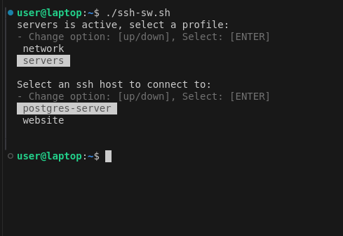
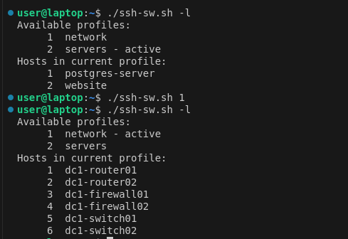

# SSH Switch

OpenSSH config file switcher, with interactive command-line interface.

 

## Installation

!! Backup your existing ssh config under `~/.ssh`

Download the [`ssh-sw.sh`](https://raw.githubusercontent.com/MMolineux/ssh-sw/master/ssh-sw.sh) to a suitable $PATH location and make it executable. That's it!

```bash
wget -O /usr/local/bin/ssh-sw https://raw.githubusercontent.com/MMolineux/ssh-sw/master/ssh-sw.sh
chmod +x /usr/local/bin/ssh-sw
```

## Usage

```text
Usage: ssh-sw [-hvrle] [-c profile_name] [-d profile_name] [host]

Description:
    Switch between and manage vanilla ssh config profiles, then easily connect to ssh hosts via a cli interface.
    
Options:
    -h|--help       Display this help message.
    -v|--version    Display version infomation.
    -b|--back {n}   Reconnect to last ssh host or select specific host from history (zero-indexed).
    -r|--reload     After editing a profile manually. Reload profile into ssh config.
    -l|--list       List available profiles and show current profile's hosts.
    -e|--edit       Edit currently active profile.
    -c|--create     Create a new empty profile with the provided profile_namep
    -d|--delete     Delete a profile by name.

Behaviour:
    Without arguments ssh-sw is interactive, providing a user friendly cli to select a profile and then connect to an ssh host.
```
